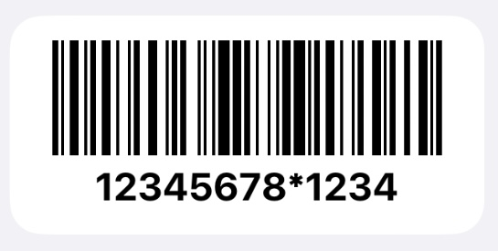

# scriptable-scripts

Here you can find some widgets and scripts for the iOS app [Scriptable](https://scriptable.app/).

   * [Widgets](#widgets)
   * [Thanks](#thanks)
---
## Widgets

* ### [OZON Barcode](ozonBarcode%2FozonBarcodeWidget.js)
  This widget displays a barcode to pick up your order at the OZON pickup point. You can add the widget to your Home Screen or Today View and scan the barcode directly from there.

  

## Thanks

* Thanks to [dukei](https://github.com/dukei/any-balance-providers) for implementing login process for OZON, without documentation it would be tough to do it.